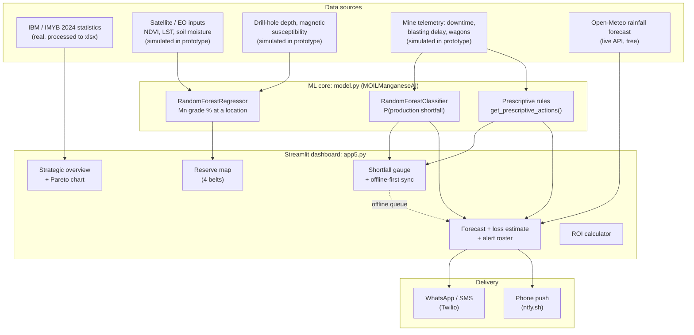

# MOIL Predictive Intelligence: AI-Driven Manganese Reserve Mapping & Shortfall Prevention

> Smart India Hackathon prototype for **MOIL Limited**, India's largest producer of manganese ore.
> A single dashboard that (1) maps likely ore grade using surface and sub-surface indicators, (2) forecasts production shortfalls before they happen, and (3) tells shift managers what to do about them.

---

## Table of contents

1. [The problem](#1-the-problem)
2. [What we built](#2-what-we-built)
3. [Why this design](#3-why-this-design)
4. [Architecture](#4-architecture)
5. [Module deep-dive](#5-module-deep-dive)
6. [Data: what is real and what is simulated](#6-data-what-is-real-and-what-is-simulated)
7. [Getting started](#7-getting-started)
8. [Repository layout](#8-repository-layout)
9. [Known limitations](#9-known-limitations)
10. [Roadmap: from prototype to deployment](#10-roadmap-from-prototype-to-deployment)

---

## 1. The problem

MOIL's reserve estimation and production planning rely mainly on **manual surveys, drilling results and production records**. This is slow, and it leads to a mismatch between *expected* and *actual* ore output. The challenge asks for an AI/ML solution that uses geological data, production history, equipment performance and satellite inputs (rainfall, soil moisture, vegetation index, land surface temperature) to:

| # | Challenge objective | Where it lives in this project |
|---|---|---|
| 1 | Identify and map manganese reserves more accurately using surface and sub-surface indicators | **Reserve mapping module** (Random Forest regressor + interactive map) |
| 2 | Predict production shortfalls from equipment downtime, weather and blasting delays | **Shortfall predictor + 3-7 day forecast** (Random Forest classifier) |
| 3 | Suggest corrective actions (reschedule, optimise blasting, redeploy equipment) | **Prescriptive engine + alert dispatch** |
| - | Deliver a user-friendly dashboard | **Streamlit app** (`app5.py`) |

### What the data says about *why* this matters

Before modelling anything, we analysed the public IBM statistics (Indian Minerals Yearbook 2024 and IBM Annual Report 2019-20). The full write-up is in [`docs/MOIL_Manganese_EDA_Report.md`](docs/MOIL_Manganese_EDA_Report.md). The findings that shaped the design:

- **Output is concentrated.** Madhya Pradesh and Maharashtra produce **61.1%** of India's manganese. Balaghat district alone produced ~**910,000 t (about 27%)** in 2023-24.
- **A few mines carry everything.** **10.1%** of mines (those above 50,000 t/yr) produce **76.4%** of output, so monitoring the large mines closely captures most of the value.
- **Most resources are unproven.** Of 503.6 Mt total resources, only **75.0 Mt (15%)** is proved *Reserves*. Goa holds the second-largest resource base but only **0.2%** of it is proved.
- **Ore quality is low.** About **69%** of output is below 35% Mn, so "tonnes mined" and "usable tonnes" are different targets.
- **Stock builds up.** Mine-head closing stock rose in every reporting state in 2023-24, which means a "shortfall" is sometimes a logistics problem rather than a mining problem.
- **India imports heavily.** About 5.59 Mt imported versus 271 t exported in 2023-24, despite being a top-6 producer. Better domestic reserve discovery and steadier output directly address this gap.

---

## 2. What we built

An interactive Streamlit dashboard, the "command center" for a mine manager, made of six sections that follow the story from *problem* to *prediction* to *action* to *business case*:

| Section | What the user sees |
|---|---|
| **Strategic overview** | Six structural problems in Indian manganese mining, the EDA charts, and an interactive Pareto chart of mine sizes |
| **Sub-surface reserve mapping** | Choose one of four manganese belts and see an interactive map of predicted Mn grade at survey points, sized by drill depth |
| **Operational shortfall predictor** | Sliders for rainfall, equipment downtime, blasting delay and rail-wagon availability produce a shortfall probability gauge, a verdict, and prioritised corrective actions |
| **Offline-first telemetry** | An Online/Offline switch. Offline, logs are saved locally and synced when connectivity returns, modelling deep shafts with no signal |
| **Forecast-driven alerts** | A 3/5/7-day rainfall forecast is scored by the model, with estimated tonnes lost per day, and alert messages are sent to the right people via WhatsApp, SMS or push |
| **Financial ROI** | Editable cost heads and AI-driven reductions produce net savings, ROI and payback over a chosen horizon |

---

## 3. Why this design

**Predict, then prescribe.** A risk score alone doesn't help a shift manager at 6 a.m. The model output feeds a rule-based prescriptive layer that turns the specific bottleneck (rain, downtime, blasting, rail) into a specific action, such as re-routing excavators from overburden stripping to the ore face.

**Tree-based models (Random Forest).** Mining data is small, tabular, noisy and non-linear (for example, rainfall only hurts output above a threshold). Random Forests handle that well, need little tuning, expose feature importances that geologists and engineers can sanity-check, and train in seconds. That last point matters for a dashboard that retrains on startup.

**Free, open satellite inputs.** The design uses Sentinel-2 (NDVI), Landsat/MODIS (land surface temperature), soil-moisture products and ISRO Bhuvan. These cost nothing, cover every lease, and refresh regularly, so the approach scales beyond MOIL's current mines.

**Offline-first.** Underground crews often have no connectivity. A tool that only works online would fail exactly where the data is generated, so the dashboard queues telemetry and alerts locally and flushes them on reconnect.

**Alerts go to people, not to a dashboard.** Managers on the ground aren't watching a screen. Forecast risk is pushed to phones over the channels they already use.

**Business case included.** Adoption in a public-sector enterprise depends on cost justification. The ROI module makes every assumption an editable input rather than a hidden number.

---

## 4. Architecture



### How a request flows

1. On startup, `init_system()` (cached with `@st.cache_resource`) instantiates `MOILManganeseAI`, generates training data, and fits both models once.
2. **Reserve path:** the user picks a belt, `generate_belt_data()` scatters 250 survey points inside that belt's bounding box, `predict_reserve_grid()` scores each point, and Plotly renders a map coloured by predicted Mn grade.
3. **Shortfall path:** slider values (or a synced offline log) go into `predict_shortfall_risk()`, which returns a probability and label. The same inputs go into `get_prescriptive_actions()`, which returns prioritised recommendations.
4. **Forecast path:** for each forecast day, rainfall is combined with the latest logged downtime, blasting delay and wagon ratio. Each day is scored, given a level (**Normal < 40%, Watch 40-70%, Critical ≥ 70%**), and given an estimated tonnage loss via `estimate_shortfall()`.
5. **Alert path:** each recipient in the editable roster has a channel and a "notify from" level. Anyone whose threshold is crossed gets a short message containing the peak-risk day, forecast rain, estimated loss and the top recommended action. Alerts are de-duplicated per person/day/level, and queued if the device is offline.

---

## 5. Module deep-dive

### 5.1 Reserve mapping (`model.py`)

- **Model:** `RandomForestRegressor` (100 trees) predicting `mn_grade_pct`.
- **Features:** latitude, longitude, drill depth (m), NDVI, land surface temperature (°C), soil moisture (%), magnetic susceptibility.
- **Belts supported:** Balaghat-Nagpur (MP/Maharashtra), Keonjhar-Sundargarh (Odisha), Bellary-Hospet (Karnataka), North Goa. The belts are chosen to include the high-unproved-resource regions identified in the EDA (Odisha, Karnataka, Goa).
- **Idea:** surface indicators (vegetation stress, thermal signature, soil moisture) and sub-surface indicators (depth, magnetics) act as covariates to *interpolate between sparse borehole samples*. This is the gap the EDA identified, since assays vary from near-zero to 35.8% Mn within a single reconnaissance area.

### 5.2 Shortfall prediction (`model.py`)

- **Model:** `RandomForestClassifier` (100 trees) predicting whether a day misses target.
- **Features:** rainfall (mm), equipment downtime (hrs), blasting delay (hrs), rail-wagon availability ratio.
- **Training data:** 365 simulated daily records with a monsoon pattern (heavy rain days ~165-265 of the year) and a coupling where heavy rain increases blasting delay.

### 5.3 Prescriptive engine (`model.py`)

Transparent, auditable rules, deliberately *not* a black box, so engineers can review and tune them:

| Trigger | Recommended action |
|---|---|
| Rainfall > 25 mm | Divert haul trucks to all-weather high-bench roads; start sump dewatering |
| Downtime > 4.5 hrs | Move secondary excavators from overburden stripping to the active high-grade face |
| Blasting delay > 2 hrs | Shift the blast window to the evening shift; feed the crusher from mine-head buffer stock |
| Wagon availability < 80% | Redirect secondary dispatches to road transport to prevent stock build-up |
| None triggered | Continue standard extraction cycle |

### 5.4 Loss estimation (`app5.py: estimate_shortfall`)

Converts risk into **tonnes**. It applies a per-driver loss curve (rain saturating near 30%; downtime, blasting and wagons counted only *beyond* planned allowances of 4 h, 1.5 h and 0.90), combines them multiplicatively, and multiplies by the daily target. The breakdown shows *which driver* dominates each day. This is a documented heuristic placeholder (see [limitations](#9-known-limitations)).

### 5.5 Alerts (`app5.py`)

- **Channels:** WhatsApp and SMS via Twilio, phone push via [ntfy.sh](https://ntfy.sh).
- **Demo mode** simulates delivery with no credentials. **Live mode** sends real messages.
- **Reliability:** offline queueing with auto-flush on reconnect, and per-person/day/level de-duplication so managers aren't spammed.
- **Live setup:** provide `TWILIO_ACCOUNT_SID`, `TWILIO_AUTH_TOKEN`, `TWILIO_SMS_FROM`, `TWILIO_WHATSAPP_FROM` as environment variables or in `.streamlit/secrets.toml`. The phone numbers and push topics in the default roster are placeholders.

### 5.6 ROI calculator (`app5.py`)

An admin console with editable cost heads (drilling, equipment, labour, survey, blasting, fuel, logistics, downtime losses...), a per-head "AI reduction %", AI platform costs, a horizon of N years and a scenario multiplier (Conservative 60% / Expected 100% / Optimistic 125%). It reports traditional versus AI-assisted cost, net savings, ROI on AI spend, payback year and cumulative-spend curves. One-time and recurring costs are treated separately, and results are undiscounted.

---

## 6. Data: what is real and what is simulated

**This is a prototype. Please read this table before quoting any number from the dashboard.**

| Component | Status | Notes |
|---|---|---|
| State/district production, reserves, grades, stocks, trade, world context | **Real** | From IBM/IMYB 2024 and IBM AR 2019-20, in `data/processed/MOIL_Manganese_Processed_Dataset.xlsx` (14 sheets) |
| Pareto chart values | **Real** (transcribed) | Read from the EDA chart, per an in-code note |
| NDVI, LST, soil moisture | **Simulated** | Uniform random draws within plausible ranges. **No satellite data is ingested yet** |
| Drill depth, magnetic susceptibility | **Simulated** | Uniform random draws |
| Mn grade (training label) | **Synthetic** | Generated from a hand-written linear formula plus noise |
| Daily operations telemetry | **Simulated** | Monsoon-shaped random draws, 365 days |
| Shortfall label | **Synthetic** | Produced by a weighted score of the same four inputs (threshold 0.65) |
| Rainfall forecast | **Real (optional)** | Live from Open-Meteo, with a demo monsoon scenario as fallback |
| Cost figures in the ROI tool | **Placeholder** | Defaults are illustrative, not MOIL data |
| Roster names / phones / topics | **Placeholder** | Replace before live use |

---

## 7. Getting started

**Prerequisites:** Python 3.10+ (developed on 3.13).

```bash
# 1. Clone and enter the project
git clone <your-repo-url>
cd SIH-MOIL--main

# 2. (Recommended) create a virtual environment
python -m venv .venv
source .venv/bin/activate        # Windows: .venv\Scripts\activate

# 3. Install dependencies
pip install -r requirements.txt

# 4. Run the dashboard
streamlit run app5.py
```

The app opens at `http://localhost:8501`. Both models train at startup in a couple of seconds.

**Optional, for live alerts**, create `.streamlit/secrets.toml`:

```toml
TWILIO_ACCOUNT_SID    = "ACxxxxxxxx"
TWILIO_AUTH_TOKEN     = "xxxxxxxx"
TWILIO_SMS_FROM       = "+1XXXXXXXXXX"
TWILIO_WHATSAPP_FROM  = "whatsapp:+1XXXXXXXXXX"
```

Push notifications need no key. Install the ntfy app and subscribe to a hard-to-guess topic name.

**Quick model check without the UI:**

```python
from model import MOILManganeseAI

ai = MOILManganeseAI()
ai.train_models()

prob, label = ai.predict_shortfall_risk(rainfall=60, downtime=6, blasting_delay=4, wagon_avail=0.7)
print(f"Shortfall probability: {prob:.0%}")
for action in ai.get_prescriptive_actions(60, 6, 4, 0.7):
    print("-", action)
```

---

## 8. Repository layout

```
.
├── app5.py                     # Streamlit dashboard (all UI sections)
├── model.py                    # MOILManganeseAI: data simulators, both RF models, prescriptive rules
├── requirements.txt            # scikit-learn, streamlit, pandas, numpy, plotly
├── data/
│   ├── raw/                    # Source PDFs: IBM Annual Report 2019-20, IMYB 2024
│   └── processed/              # MOIL_Manganese_Processed_Dataset.xlsx (14 sheets)
├── charts/                     # 11 EDA charts shown in the dashboard and report
├── docs/
│   └── MOIL_Manganese_EDA_Report.md
├── image.png                   # Page icon
├── background.png / background.py   # Optional background-image helper (not used by app5.py)
└── pick.png
```

---

## 9. Known limitations

We'd rather state these plainly than have them discovered later.

1. **Model scores describe the simulator, not the mines.** The shortfall label is computed from the same four inputs the classifier sees, so its very high hold-out accuracy (about 99% in our test run) shows it has learned our labelling rule, not real-world behaviour. The reserve regressor reaches an R² of about 0.5 on data generated from a linear formula. Neither number is evidence of real-world accuracy.
2. **The reserve map is illustrative.** Points are randomly scattered inside each belt's bounding box, so the "hotspots" carry no geological meaning yet. Latitude and longitude are model features, but in the synthetic data grade does not depend on location.
3. **">46% Mn" targeting is not calibrated.** In the synthetic data only about 2% of samples exceed 46% Mn.
4. **No satellite ingestion yet.** NDVI, LST and soil moisture are simulated. Only rainfall is fetched live.
5. **Loss estimation is a heuristic.** `estimate_shortfall` uses hand-set curves and allowances, not a trained regressor.
6. **Prescriptive thresholds are assumptions.** The 25 mm / 4.5 h / 2 h / 80% thresholds need tuning against MOIL operating data.
7. **The classifier is not calibrated.** The probabilities are raw Random Forest outputs and are drawn from a single simulated year.
8. **Offline mode is simulated in-session.** The queue lives in Streamlit session state, not durable device storage, so a real deployment needs a proper local store.
9. **ROI defaults are placeholders**, and results are undiscounted.
10. **Housekeeping:** `background.py` is not imported by `app5.py` and refers to `background.jpg` (the file is `background.png`). Image links in the EDA report point to `eda_charts/` while the folder is named `charts/`.

---

## 10. Roadmap: from prototype to deployment

| Phase | Work | Data / source |
|---|---|---|
| **1. Real EO data** | Replace simulated indicators with NDVI (Sentinel-2), LST (Landsat/MODIS), soil moisture, rainfall history (IMD/CHIRPS/GPM) sampled per lease | ISRO Bhuvan, Copernicus, NASA |
| **2. Real ground truth** | Train the reserve model on actual borehole assays with spatial cross-validation (hold out *regions*, not random rows) and report uncertainty (for example quantile forests or kriging residuals) | MOIL geology/drilling records |
| **3. Real operations data** | Replace simulated telemetry with equipment logs, blast schedules and rake/dispatch data; train on real shortfall events with time-based validation | MOIL SCADA / ERP / fleet management |
| **4. Better targets** | Model raw tonnes *and* beneficiation-adjusted usable tonnes; add mine-head stock and dispatch as signals, so logistics-driven shortfalls are distinguished from mining-driven ones | IBM data + MOIL stock records |
| **5. Learned prescriptions** | Move from fixed rules to optimisation (equipment redeployment, blast scheduling) with human-in-the-loop approval | Historical decisions and outcomes |
| **6. Production hardening** | Durable offline store, authentication and roles, audit logs, model monitoring and drift detection, calibrated probabilities | Deployment infrastructure |

---

### Data sources

- Indian Bureau of Mines, *Indian Minerals Yearbook 2024*, Ch. 47 Manganese Ore
- Indian Bureau of Mines, *Annual Report 2019-20*
- Open-Meteo (live precipitation forecast)
- Intended production sources: Sentinel-2, Landsat/MODIS, ISRO Bhuvan

*Built for Smart India Hackathon, problem statement: MOIL Limited, AI/ML-based reserve identification and production shortfall prediction.*
